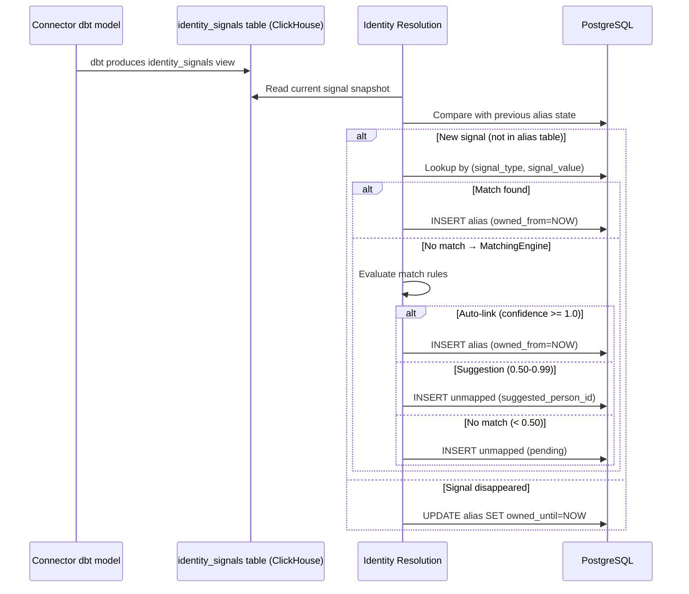
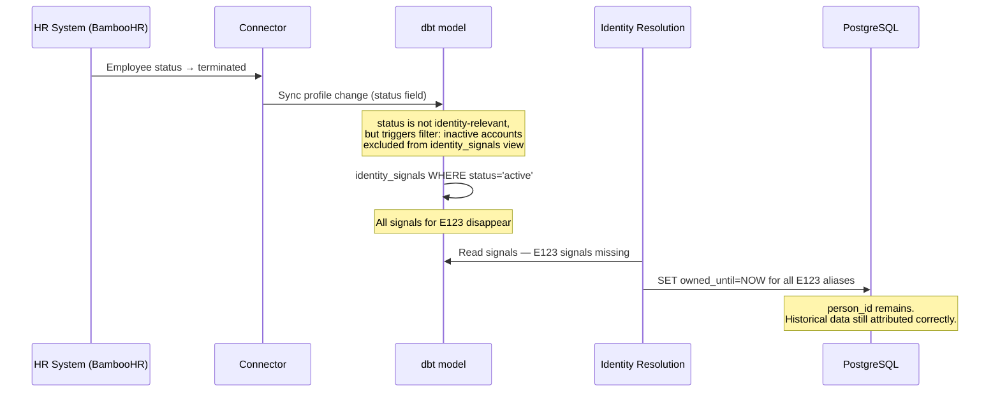
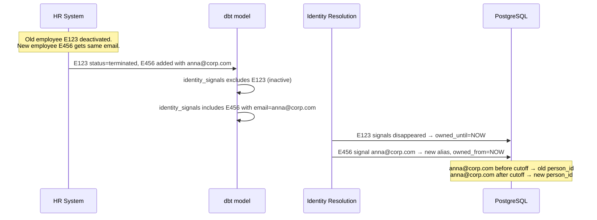

# DESIGN — Identity Resolution (v2)

> Rework of DESIGN.md. Focuses Identity Resolution on its core responsibility: mapping source account identifiers to canonical person records. Org hierarchy, Golden Record, MDM, and SCD2 attribute history are explicitly out of scope.

<!-- toc -->

- [1. Architecture Overview](#1-architecture-overview)
  - [1.1 Architectural Vision](#11-architectural-vision)
  - [1.2 Scope Boundary](#12-scope-boundary)
  - [1.3 Architecture Drivers](#13-architecture-drivers)
  - [1.4 Position in Pipeline](#14-position-in-pipeline)
- [2. Principles & Constraints](#2-principles--constraints)
  - [2.1 Design Principles](#21-design-principles)
  - [2.2 Constraints](#22-constraints)
- [3. Technical Architecture](#3-technical-architecture)
  - [3.1 Identity Signal Contract](#31-identity-signal-contract)
  - [3.2 Signal Lifecycle](#32-signal-lifecycle)
  - [3.3 Component Model](#33-component-model)
  - [3.4 Matching Engine](#34-matching-engine)
  - [3.5 Database Schema](#35-database-schema)
  - [3.6 Interactions & Sequences](#36-interactions--sequences)
- [4. Connector Integration](#4-connector-integration)
  - [4.1 dbt Identity Signal Model](#41-dbt-identity-signal-model)
  - [4.2 Adding a New Connector](#42-adding-a-new-connector)
  - [4.3 Account Deactivation Handling](#43-account-deactivation-handling)
  - [4.4 Account Reassignment (Email Reuse)](#44-account-reassignment-email-reuse)
- [5. Open Questions](#5-open-questions)
- [6. Traceability](#6-traceability)

<!-- /toc -->

---

## 1. Architecture Overview

### 1.1 Architectural Vision

Identity Resolution answers one question: **given a source account identifier, what is the `person_id`?**

Every connected source system (GitLab, Jira, BambooHR, Slack, etc.) has its own user profiles. Identity Resolution maps these disparate accounts to canonical person records, enabling cross-system analytics — correlating a person's Git commits with their Jira tasks, calendar events, and HR data.

IdRes does not know the schema of any source system. Instead, each connector extracts identity-relevant fields into a standardized **identity signal** format. IdRes works exclusively with these signals.

### 1.2 Scope Boundary

**In scope** — core identity mapping:

| Responsibility | Description |
|---|---|
| Signal ingestion | Receive identity signals from connectors via standardized contract |
| Person registry | Create and maintain canonical `person_id` records |
| Alias mapping | `(source_system, source_account_id) → person_id` |
| Matching engine | Rules for linking signals to persons (exact, normalization, fuzzy) |
| Unmapped queue | Quarantine unresolvable signals for operator review |
| Merge / split | Correct mistaken links with full audit trail |

**Out of scope** — moved to separate domains:

| Topic | Why not IdRes | Where it belongs |
|---|---|---|
| Org hierarchy (departments, teams, transfers) | Consumes `person_id`, does not produce it | Org Structure / People Directory domain |
| Golden Record (best-value profile assembly) | Master Data Management concern | MDM domain |
| Conflict detection between sources | MDM concern | MDM domain |
| SCD2 attribute history (name changes, role changes) | Already handled by dbt transformations inside connectors | Connector dbt models |
| ClickHouse Dictionary / External Engine / CDC | Infrastructure / data delivery | Data Integration layer |
| GDPR erasure | Cross-cutting compliance concern | Compliance domain |

### 1.3 Architecture Drivers

#### Functional Drivers

| Requirement | Design Response |
|---|---|
| Resolve source accounts to `person_id` | `ResolutionService` — alias table lookup (hot path), match rules (cold path) |
| Source-agnostic signal ingestion | Standardized `identity_signal` contract; IdRes never parses source-native schemas |
| Connector change-detection integration | Connectors emit identity events (added/removed signals) on profile changes only |
| Handle account deactivation | Connector stops emitting signals for deactivated accounts; IdRes closes `owned_until` |
| Handle email/username reassignment | Old owner: signal removed → `owned_until`; new owner: signal added → `owned_from` |
| Merge incorrectly split persons | `ResolutionService.merge()` — ACID transaction + snapshot in `merge_audit` |
| Split wrongly merged persons | `ResolutionService.split()` — restore from `merge_audit.snapshot_before` |
| No false-positive auto-links | Fuzzy rules never trigger auto-link; always route to operator review |

#### NFR Allocation

| NFR | Allocated To | Design Response | Verification |
|---|---|---|---|
| ACID for merge / split | RDBMS (PostgreSQL) | All merges in single transaction with rollback | Merge + rollback integration tests |
| Alias lookup latency < 1 ms | ClickHouse Dictionary | Dictionary cached in memory; reloads every 30–60 s | Benchmark with 10K/s lookup rate |
| Idempotency | Signal processing | Natural key `(source_system, source_account_id, signal_type, signal_value)` | Process same events 3x; verify no duplicates |
| No fuzzy auto-link | MatchingEngine | Fuzzy rules disabled by default; never trigger auto-link | Audit test: enable fuzzy; assert no auto-link |
| Multi-tenancy isolation | All tables | `tenant_id` on all tables | Cross-tenant resolution returns empty |

### 1.4 Position in Pipeline

```
Connectors → Bronze (raw) → dbt Silver step 1 (class_*)
                                     │
                                     ├─ dbt identity_signal model (per connector)
                                     │        │
                                     │        ▼
                                     │  Identity Resolution (RDBMS)
                                     │        │
                                     │        ▼
                                     │  person_id mapping table
                                     │        │
                                     ▼        ▼
                              Silver step 2 (class_* + person_id)
                                     │
                                     ▼
                                   Gold
```

Identity Resolution sits between Silver step 1 and Silver step 2. Connectors produce identity signals as part of their dbt transformations. IdRes processes these signals and produces the `(source_system, source_account_id) → person_id` mapping. Silver step 2 joins this mapping to enrich all `class_*` tables with `person_id`.

---

## 2. Principles & Constraints

### 2.1 Design Principles

#### Source-Agnostic Signals

IdRes never parses source-native data. Each connector extracts identity-relevant fields into the standardized signal contract. Adding a new connector requires no changes to IdRes.

#### Event-Driven Signal Processing

Connectors track profile changes via dbt. Only when identity-relevant fields change does the connector emit an identity event (added/removed signals). Unchanged profiles produce no events.

#### Conservative Matching

Deterministic matching first (exact email, exact employee ID). Fuzzy matching is opt-in per rule and **never triggers auto-link** — always routes to human review. This is non-negotiable after production experience with false-positive merges.

#### Explicit Alias Ownership

Every alias belongs to exactly one person at any point in time. Temporal ownership (`owned_from` / `owned_until`) tracks when a signal was active. Historical data is attributed to the person who owned the alias at the time of the event.

#### Fail-Safe Defaults

Unknown signals are quarantined in the `unmapped` table. The pipeline continues. Records with unresolved `person_id` appear as `UNRESOLVED` in analytics but do not corrupt resolved data.

### 2.2 Constraints

#### RDBMS for Identity, ClickHouse for Analytics

ACID transactions are required for merge/split atomicity. ClickHouse lacks row-level transactions. Canonical identity data lives in PostgreSQL; ClickHouse reads it via Dictionary for analytical JOINs.

#### No Fuzzy Auto-Link

Fuzzy matching rules (Jaro-Winkler, Soundex) MUST NEVER trigger automatic alias creation. They may only generate suggestions for human review.

#### Half-Open Temporal Intervals

All temporal ranges use `[owned_from, owned_until)` half-open intervals. `owned_from` is inclusive. `owned_until` is exclusive. `owned_until IS NULL` means "currently active". `BETWEEN` is prohibited on temporal columns.

---

## 3. Technical Architecture

### 3.1 Identity Signal Contract

Every connector that has user profiles MUST produce identity signals in this standardized format. A signal is a `(type, value)` pair tied to a source account.

**Signal schema** (one row per identity-relevant field per account):

| Column | Type | Description |
|---|---|---|
| `tenant_id` | String | Tenant isolation — propagated from Bronze |
| `source_system` | String | Source identifier, e.g. `gitlab-prod`, `bamboohr` |
| `source_id` | String | Connector instance identifier — propagated from Bronze |
| `source_account_id` | String | Unique account ID within the source system |
| `signal_type` | String | Type of identity signal (see vocabulary below) |
| `signal_value` | String | Normalized value |

**Signal type vocabulary**:

| `signal_type` | Description | Example |
|---|---|---|
| `email` | Email address (lowercased, trimmed) | `anna.ivanova@corp.com` |
| `username` | Username / login / handle | `ivanova.anna` |
| `employee_id` | HR system employee identifier | `E123` |
| `display_name` | Full display name | `Anna Ivanova` |
| `platform_id` | Numeric / opaque platform-specific ID | `12345` |

One source account typically emits **multiple signals**. For example, a BambooHR profile with work email, personal email, and employee ID produces three signal rows.

**Normalization rules** (applied by connector before emitting):

| `signal_type` | Normalization |
|---|---|
| `email` | `lower(trim(value))` |
| `username` | `lower(trim(value))` |
| `employee_id` | `trim(value)` |
| `display_name` | `trim(value)` |
| `platform_id` | `trim(value)` |

### 3.2 Signal Lifecycle

Connectors track profile changes via dbt change-detection models. When identity-relevant fields change, the connector emits an identity event describing what was added or removed.

#### Event types

| Event | When | IdRes reaction |
|---|---|---|
| Signal added | New account, or existing account gains a new identity field | Create alias with `owned_from = NOW()` |
| Signal removed | Identity field cleared, account deactivated, account deleted | Close alias: `owned_until = NOW()` |
| Signal changed | Field value changed (e.g. email update) | Remove old + add new (two events) |

#### What triggers signal removal

The connector is responsible for determining when signals should stop being emitted. IdRes does not interpret source-specific business logic.

| Source event | Connector action | IdRes sees |
|---|---|---|
| Account deactivated (`status: terminated`) | Stop emitting all signals for this account | Signals removed → `owned_until` set |
| Email field cleared | Stop emitting that email signal | Signal removed → `owned_until` set |
| Email changed to new value | Remove old email signal, add new | Old alias closed, new alias created |
| Account deleted from source | Stop emitting all signals | Signals removed → `owned_until` set |

The key insight: **account deactivation is not a special case**. The connector knows its business logic (what `status: terminated` means in BambooHR). It translates that into the generic action "stop emitting signals for this account". IdRes treats it identically to any other signal removal.

### 3.3 Component Model

#### ResolutionService

Entry point for alias resolution, merge/split, and unmapped queue management.

**Responsibilities**:
- `resolve(source_system, source_account_id, tenant_id)` → `person_id` or `null`
- Hot path: alias table lookup (~90% after bootstrap)
- Cold path: MatchingEngine evaluation for unresolved signals
- `merge(source_person_id, target_person_id, reason, performed_by)` — ACID transaction
- `split(audit_id, performed_by)` — restore from `merge_audit.snapshot_before`
- `process_events(events[])` — process identity signal events (added/removed)

#### MatchingEngine

Evaluates match rules against candidate persons for cold-path resolution.

**Responsibilities**:
- Load enabled `match_rule` rows ordered by `sort_order`
- Evaluate each rule and compute composite confidence
- Apply thresholds: `>= 1.0` → auto-link; `0.50–0.99` → suggestion; `< 0.50` → unmapped
- Fuzzy rules NEVER trigger auto-link regardless of score

#### BootstrapJob

Initial seeding of the person registry from the first batch of identity signals.

**Responsibilities**:
- On first run: process all current signals, create persons and aliases
- On subsequent runs: process only new/changed signals (events)
- Auto-resolve `unmapped` entries that match newly created aliases

### 3.4 Matching Engine

#### Phases

**Phase B1 — Deterministic (auto-link threshold = 1.0)**:

| Rule | Confidence | Description |
|---|---|---|
| `email_exact` | 1.0 | Identical email signal across two source accounts |
| `employee_id_match` | 1.0 | Identical employee_id signal |
| `username_same_system` | 0.95 | Same username within the same system type |

**Phase B2 — Normalization & Cross-System (auto-link threshold >= 0.95)**:

| Rule | Confidence | Description |
|---|---|---|
| `email_plus_tag` | 0.93 | Email match ignoring `+tag` suffix |
| `email_domain_alias` | 0.92 | Same local part, known domain alias |
| `username_cross_system` | 0.85 | Same username across related systems |
| `email_to_username` | 0.72 | Email local part matches username in another system |

**Phase B3 — Fuzzy (disabled by default, NEVER auto-link)**:

| Rule | Confidence | Description |
|---|---|---|
| `name_jaro_winkler` | 0.75 | Jaro-Winkler similarity >= 0.95 on display_name |
| `name_soundex` | 0.60 | Phonetic matching (Soundex) on display_name |

#### Confidence thresholds

| Confidence range | Action |
|---|---|
| `>= 1.0` | Auto-link: create alias automatically |
| `0.50 – 0.99` | Suggestion: write to `unmapped` with `suggested_person_id` |
| `< 0.50` | Unmapped: write to `unmapped` as pending |

#### Email normalization pipeline

```
Input: "John.Doe+test@Constructor.TECH"
  1. lowercase        → "john.doe+test@constructor.tech"
  2. trim whitespace  → "john.doe+test@constructor.tech"
  3. remove plus tags → "john.doe@constructor.tech"
  4. domain alias     → also matches "john.doe@constructor.dev"
```

### 3.5 Database Schema

**Technology**: PostgreSQL

All tables carry `tenant_id` for multi-tenancy isolation. All temporal columns use half-open intervals.

#### Table: `person`

Canonical person record. One row per person.

| Column | Type | Notes |
|---|---|---|
| `person_id` | UUID | PK |
| `tenant_id` | VARCHAR(100) | Tenant isolation |
| `status` | ENUM | `active`, `merged`, `deleted` |
| `created_at` | TIMESTAMP | |
| `updated_at` | TIMESTAMP | |

#### Table: `alias`

Maps identity signals to persons. One person can have many aliases. Each alias has exactly one active owner at any point in time.

| Column | Type | Notes |
|---|---|---|
| `id` | BIGINT | PK |
| `person_id` | UUID | FK → `person` |
| `tenant_id` | VARCHAR(100) | |
| `source_system` | VARCHAR(100) | e.g. `gitlab-prod`, `bamboohr` |
| `source_account_id` | VARCHAR(500) | Account ID in the source system |
| `signal_type` | VARCHAR(50) | `email`, `username`, `employee_id`, `display_name`, `platform_id` |
| `signal_value` | VARCHAR(500) | Normalized value |
| `confidence` | DECIMAL(3,2) | Default 1.00 |
| `status` | ENUM | `active`, `inactive` |
| `owned_from` | TIMESTAMP | When IdRes first observed this signal |
| `owned_until` | TIMESTAMP NULL | When signal was removed; NULL = currently active |
| `created_at` | TIMESTAMP | |

**Indexes**:
- Partial unique: `(signal_type, signal_value, source_system, tenant_id) WHERE owned_until IS NULL` — one active owner per signal
- Lookup: `(source_system, source_account_id, tenant_id)` — resolve account to person
- Lookup: `(signal_type, signal_value, tenant_id)` — find person by signal value

#### Table: `match_rule`

Configurable matching rules.

| Column | Type | Notes |
|---|---|---|
| `id` | INT | PK |
| `name` | VARCHAR(100) | Unique |
| `rule_type` | ENUM | `exact`, `normalization`, `cross_system`, `fuzzy` |
| `weight` | DECIMAL(3,2) | |
| `is_enabled` | BOOLEAN | Default `true` |
| `phase` | ENUM | `B1`, `B2`, `B3` |
| `condition_type` | VARCHAR(50) | `email_exact`, `email_plus_tag`, `username_cross_system`, etc. |
| `config` | JSONB | Rule-specific parameters |
| `sort_order` | INT | Evaluation order within phase |
| `updated_by` | VARCHAR(100) | |
| `updated_at` | TIMESTAMP | |

#### Table: `unmapped`

Queue of signals that could not be resolved automatically.

| Column | Type | Notes |
|---|---|---|
| `id` | BIGINT | PK |
| `tenant_id` | VARCHAR(100) | |
| `source_system` | VARCHAR(100) | |
| `source_account_id` | VARCHAR(500) | |
| `signal_type` | VARCHAR(50) | |
| `signal_value` | VARCHAR(500) | |
| `status` | ENUM | `pending`, `in_review`, `resolved`, `ignored` |
| `suggested_person_id` | UUID NULL | Candidate from MatchingEngine |
| `suggestion_confidence` | DECIMAL(3,2) NULL | |
| `resolved_person_id` | UUID NULL | |
| `resolved_at` | TIMESTAMP NULL | |
| `resolved_by` | VARCHAR(100) NULL | |
| `resolution_type` | ENUM NULL | `linked`, `new_person`, `ignored` |
| `first_seen` | TIMESTAMP | |
| `last_seen` | TIMESTAMP | |
| `occurrence_count` | INT | |

#### Table: `merge_audit`

Audit trail for merge/split operations with full state snapshots for rollback.

| Column | Type | Notes |
|---|---|---|
| `id` | BIGINT | PK |
| `action` | ENUM | `merge`, `split` |
| `target_person_id` | UUID | FK → `person` (surviving person) |
| `source_person_id` | UUID | FK → `person` (merged-away person) |
| `snapshot_before` | JSONB | Full alias state before operation |
| `snapshot_after` | JSONB | Full alias state after operation |
| `reason` | TEXT | |
| `performed_by` | VARCHAR(100) | |
| `performed_at` | TIMESTAMP | |
| `rolled_back` | BOOLEAN | Default false |
| `rolled_back_at` | TIMESTAMP NULL | |
| `rolled_back_by` | VARCHAR(100) NULL | |

### 3.6 Interactions & Sequences

#### Signal Processing (Normal Flow)



#### Account Deactivation (Termination)



#### Email Reassignment (New Employee Gets Old Email)



#### Merge / Split

```
MERGE (target=person_A, source=person_B):
  BEGIN;
    1. Snapshot aliases of A and B → merge_audit.snapshot_before
    2. UPDATE alias SET person_id = A WHERE person_id = B
    3. UPDATE person SET status = 'merged' WHERE person_id = B
    4. INSERT merge_audit (snapshot_after, performed_by)
  COMMIT;

SPLIT (rollback of merge by audit_id):
  BEGIN;
    1. Load snapshot_before from merge_audit
    2. Assert rolled_back = false
    3. Restore alias → person_id from snapshot
    4. Restore person B status = 'active'
    5. Mark audit: rolled_back = true
  COMMIT;
```

---

## 4. Connector Integration

### 4.1 dbt Identity Signal Model

Each connector that has user profiles produces a dbt model conforming to the identity signal contract. This model is part of the connector's dbt package (see [Connector DESIGN §4.13](../../connector/specs/DESIGN.md#413-dbt-model-rules)).

**Example: BambooHR**

```sql
-- connectors/hr-directory/bamboohr/dbt/to_identity_signals.sql
{{ config(materialized='view', tags=['bamboohr']) }}

SELECT
    tenant_id,
    source_id,
    'bamboohr'                    AS source_system,
    employee_id                   AS source_account_id,
    'email'                       AS signal_type,
    lower(trim(work_email))       AS signal_value
FROM {{ source('bronze', 'employees') }}
WHERE status = 'active'
  AND work_email IS NOT NULL

UNION ALL

SELECT
    tenant_id,
    source_id,
    'bamboohr',
    employee_id,
    'email',
    lower(trim(home_email))
FROM {{ source('bronze', 'employees') }}
WHERE status = 'active'
  AND home_email IS NOT NULL

UNION ALL

SELECT
    tenant_id,
    source_id,
    'bamboohr',
    employee_id,
    'employee_id',
    trim(employee_id)
FROM {{ source('bronze', 'employees') }}
WHERE status = 'active'

UNION ALL

SELECT
    tenant_id,
    source_id,
    'bamboohr',
    employee_id,
    'display_name',
    trim(concat(first_name, ' ', last_name))
FROM {{ source('bronze', 'employees') }}
WHERE status = 'active'
  AND first_name IS NOT NULL
```

**Example: GitLab**

```sql
-- connectors/git/gitlab/dbt/to_identity_signals.sql
{{ config(materialized='view', tags=['gitlab']) }}

SELECT
    tenant_id,
    source_id,
    'gitlab-prod'                 AS source_system,
    toString(id)                  AS source_account_id,
    'email'                       AS signal_type,
    lower(trim(email))            AS signal_value
FROM {{ source('bronze', 'users') }}
WHERE state = 'active'
  AND email IS NOT NULL

UNION ALL

SELECT
    tenant_id,
    source_id,
    'gitlab-prod',
    toString(id),
    'username',
    lower(trim(username))
FROM {{ source('bronze', 'users') }}
WHERE state = 'active'
  AND username IS NOT NULL
```

**Key rules**:
- Model name: `to_identity_signals.sql`
- Materialized as `view` (no extra storage)
- Tagged with connector name for selective execution
- Filter: only active accounts (connector knows its own deactivation semantics)
- Normalize values before emitting (lowercase, trim)
- NULL values are excluded (no empty signals)
- Mandatory columns from Bronze preserved: `tenant_id`, `source_id`

### 4.2 Adding a New Connector

Adding a new data source requires **no changes to IdRes**:

1. Write `to_identity_signals.sql` in the connector's dbt directory following the signal contract
2. Add `WHERE` filter appropriate for the source's active/inactive semantics
3. Map source-specific fields to signal types (`email`, `username`, `employee_id`, `display_name`, `platform_id`)
4. Register `source_system` name in IdRes configuration (for match rule scoping)

### 4.3 Account Deactivation Handling

When a source system deactivates an account (termination, suspension, deletion), the connector's dbt model stops emitting signals for that account. This happens naturally through the `WHERE status = 'active'` filter in `to_identity_signals.sql`.

IdRes detects that the signals have disappeared and sets `owned_until = NOW()` on all aliases for that source account. The `person_id` remains — historical data attributed to this person stays correctly linked.

**No special event type is needed for deactivation.** The connector translates its source-specific business logic ("employee terminated") into the generic outcome ("signals stop being emitted"). IdRes does not need to know why signals disappeared.

### 4.4 Account Reassignment (Email Reuse)

When an email address is reassigned from a deactivated account to a new account:

1. Old account is inactive → its signals are already excluded from the view
2. New account emits the email signal
3. IdRes sees: old alias has `owned_until` set (from deactivation); new signal appears for a different `source_account_id`
4. IdRes creates a new alias for the new person with `owned_from = NOW()`

Temporal ownership ensures historical queries resolve the email to the correct person at each point in time.

**Prerequisite**: the connector MUST filter out inactive accounts from `to_identity_signals.sql`. Without this filter, both old and new accounts would emit the same email signal simultaneously, violating the one-active-owner constraint.

---

## 5. Open Questions

### OQ-IR-v2-01: Snapshot vs Event-Driven Signal Processing

**Question**: Should IdRes compare the full signal snapshot on each run (diff-based), or should connectors explicitly emit added/removed events?

**Current approach**: Snapshot-based. The `to_identity_signals.sql` view represents the current state. IdRes compares it with the previous alias state to determine what changed. This is simpler to implement and leverages the existing dbt view infrastructure.

**Alternative**: Event-driven. Connectors use dbt snapshot/change-detection to emit explicit added/removed events. More efficient for large datasets but adds complexity to connector dbt models.

---

### OQ-IR-v2-02: RDBMS Choice

**Question**: PostgreSQL only, or also support MariaDB?

**Current approach**: PostgreSQL only. Partial unique indexes, RLS, and DEFERRABLE FK constraints are native. MariaDB support adds complexity with workarounds (generated columns, application-level FK deferral) for marginal benefit.

---

### OQ-IR-v2-03: Relationship to Min-Propagation Algorithm

**Question**: The original `inbox/IDENTITY_RESOLUTION.md` describes a ClickHouse-native min-propagation algorithm for bulk identity grouping. Is this complementary to the RDBMS-based approach (e.g. for initial bulk seeding) or fully superseded?

**Current approach**: Treated as a separate earlier implementation. The RDBMS + signal-based approach is canonical for incremental processing.

---

## 6. Traceability

- **Supersedes**: `docs/domain/identity-resolution/specs/DESIGN.md` (v1)
- **Source V2-V4**: `inbox/architecture/IDENTITY_RESOLUTION_V2.md`, `V3.md`, `V4.md`
- **Source algorithm**: `inbox/IDENTITY_RESOLUTION.md` — ClickHouse-native min-propagation
- **Source walkthrough**: `inbox/architecture/EXAMPLE_IDENTITY_PIPELINE.md`
- **Connector integration contract**: `docs/domain/connector/specs/DESIGN.md` — §3.7 (mandatory fields), §4.13 (dbt model rules)
- **Ingestion pipeline**: `docs/domain/ingestion/specs/DESIGN.md` — §3.7 (Bronze/Silver table schemas)
